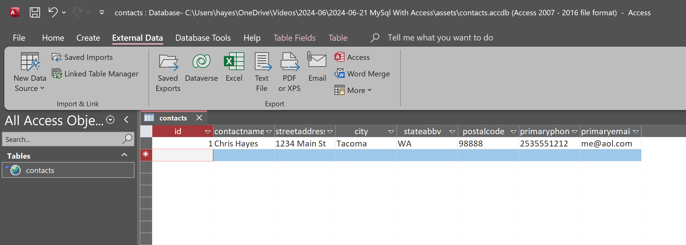

# Show Notes 2024-06-21 Connecting MySql to MS Access
## Prerequisites:
You will need [chocolatey installed]( https://chocolatey.org/install)
## Install MySql with Chocolatey
- [The MySql Server](https://community.chocolatey.org/packages/mysql)
- [The MySql CLI](https://community.chocolatey.org/packages/mysql-cli)
- [The MySql ODBC Driver](https://community.chocolatey.org/packages/mysql.odbc)
## Create a unique password to store in environment variable
- [Instructions for creating environment variables](https://gist.github.com/mitchmindtree/92c8e37fa80c8dddee5b94fc88d1288b)
- Create a random string for the password value, [here’s a site to help](https://www.random.org/strings/)
- Call the variable `MYSQL_PWD`, this is the default password env var for root user
## Set your new password for root
- Run the following command in PowerShell: `mysql -u root -e "ALTER USER 'root'@'localhost' IDENTIFIED BY '$($env:MYSQL_PWD)'" -p`
- when prompted for password, just press [[ENTER]]
## Create a database
- [MySql Docs on Databasse Creation](https://dev.mysql.com/doc/refman/8.4/en/creating-database.html)
- Open `mysql` prompt. In your powershell session type and execute the following command: `mysql -u root` you should not get prompted for password if you followed above instructions
- run create database command: `CREATE DATABASE ContactOutreach;` ensure you end statement with semicolon `;`
- set session to use the new database `USE ContactOutreach;`
## Create your first table
- here's a helpfull tool for constructing your `CREATE` script from a gui: (https://codebeautify.org/sql-table-generator)
- Execute the following command in the prompt:
```
CREATE TABLE contacts (
    id INT(20) NOT NULL AUTO_INCREMENT,
    contactname VARCHAR(25) NOT NULL,
    streetaddress VARCHAR(50),
    city VARCHAR(25),
    stateabbv VARCHAR(2),
    postalcode VARCHAR(10),
    primaryphone VARCHAR(10),
    primaryemail VARCHAR(100),
    PRIMARY KEY (id)
);
```
## View and edit MySql tables in MS Access
- [MySql docs on using MySql in MS Access](https://dev.mysql.com/doc/connector-odbc/en/connector-odbc-examples-tools-with-access-linked-tables.html)
- Open MS Access
- Click on the New Database button (blank)
- Name it ‘Contacts’ and save it where you like
- Close the default table that pops up when opening, we’re not using it
- Open an external data source:

- Select 'LINK' to datasource NOT IMPORT

- Create a new datasource if one does not already exist

- Select the UNICODE version of driver

- Fill in database details

- Select our newly created datasource

- Import our table

- Let's add a record to our table

- Let's preview our record from the console
