# Show Notes 2024-06-22 Adding a Related Table
> Continuation of MySql in MS Access. see: [MySql in MS Access](../2024-06-21/shownotes.md)

## Add new table
- open mysql prompt: `mysql -u root`
- set the proper db context, run:
```
USE contactoutreach;
```
- run the following command:
```
CREATE TABLE sponsors (
  `id` int NOT NULL AUTO_INCREMENT,
  `sponsorname` varchar(25) NOT NULL,
  `primaryphone` varchar(10) DEFAULT NULL,
  `primaryemail` varchar(100) DEFAULT NULL,
  PRIMARY KEY (`id`)
);
```
- this creates a new table to store sponsor info
## Add foriegn key to original table
- run the `ALTER TABLE` command to add a new column:
```
ALTER TABLE contacts
ADD sponsorid int;
```
## Link new table in MS Access
- Open the Connection Dialog
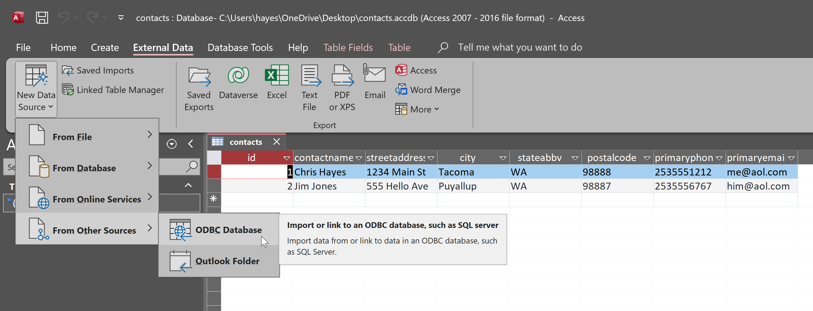
- Select Link to data
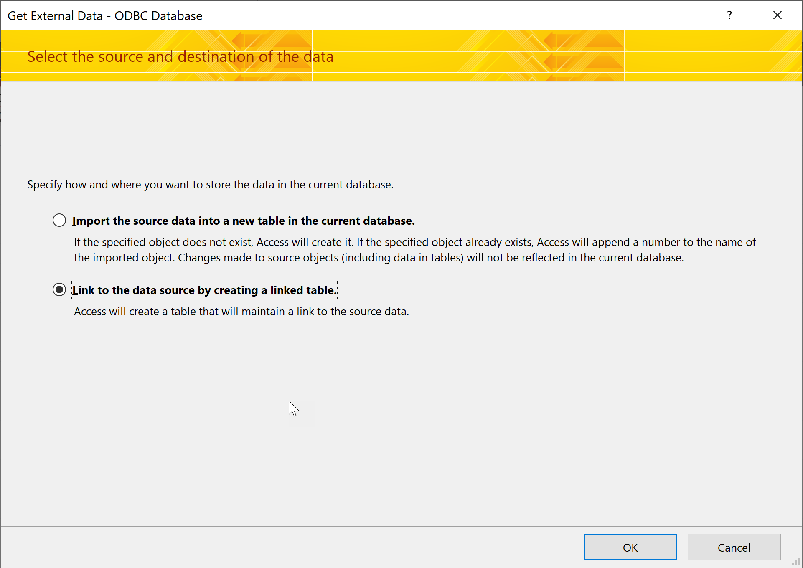
- Select Datasource ContactsOutreach
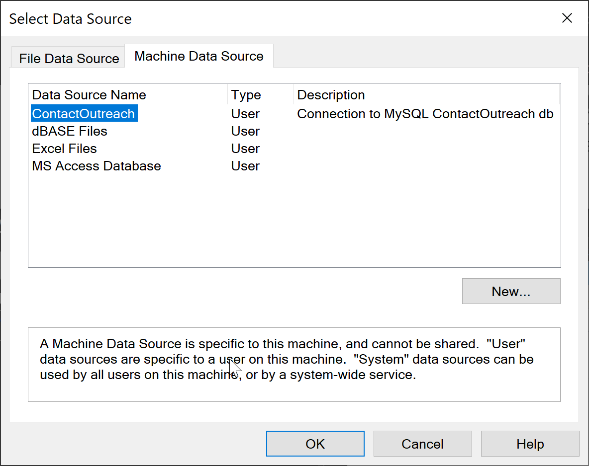
- Insert our new table
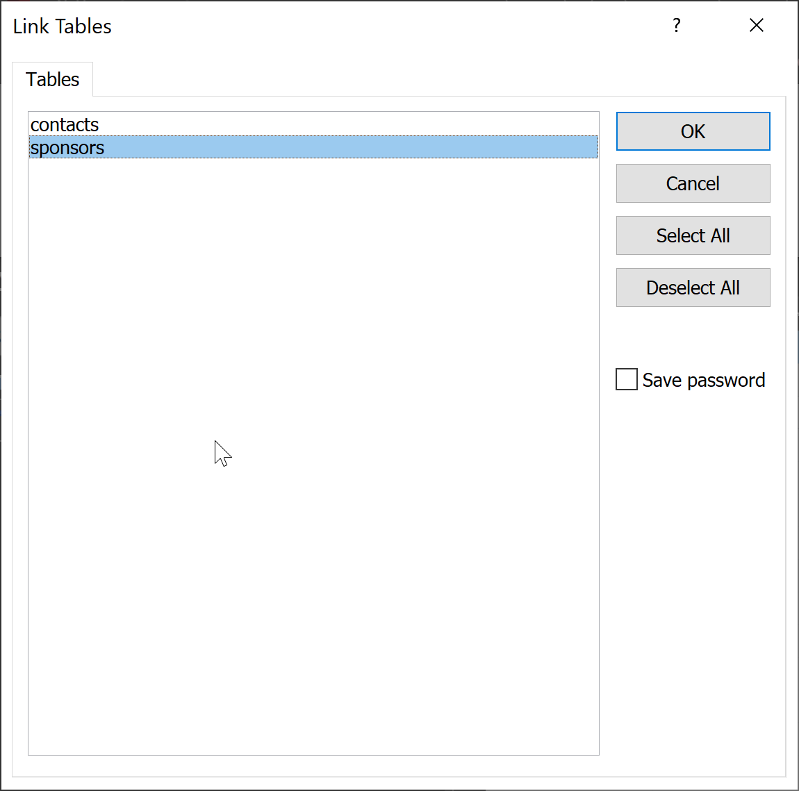
## Re-link original table in MS Access
Now that our original contacts table has a new column we will have to reconnect it.
- Ensure the contacts table is closed
- Select the contacts table and press delete
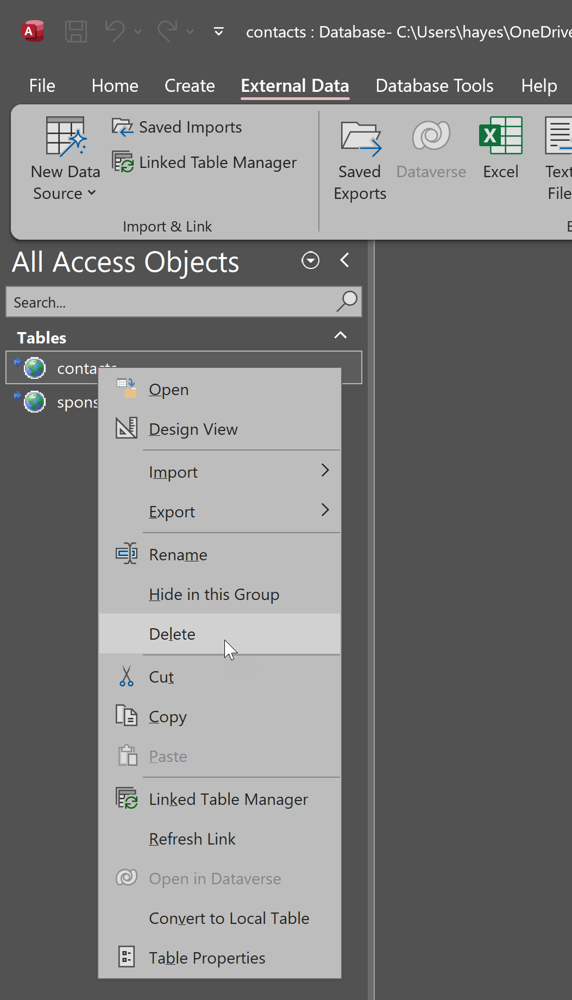
- Open the Connection Dialog

- Select Link to data

- Select Datasource ContactsOutreach

- Insert `contacts` table
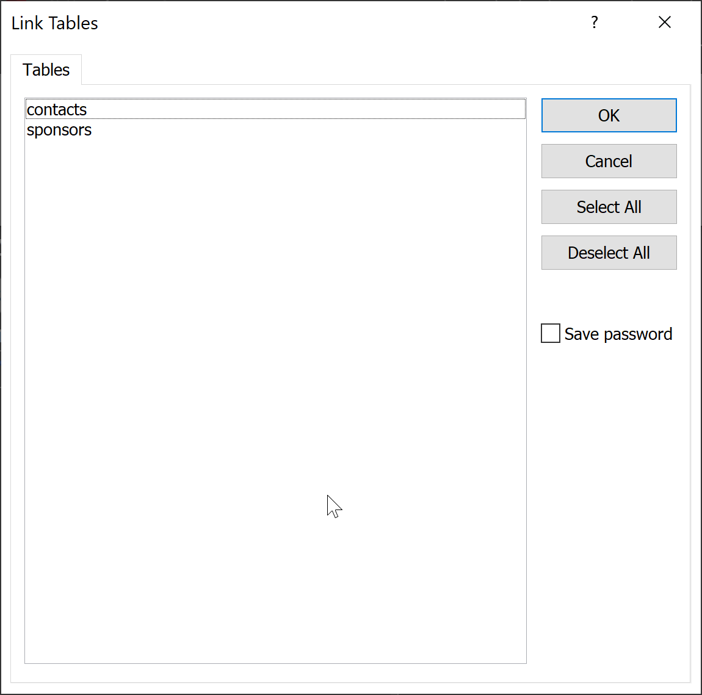
## Add some new records
- open the `sponsors` table
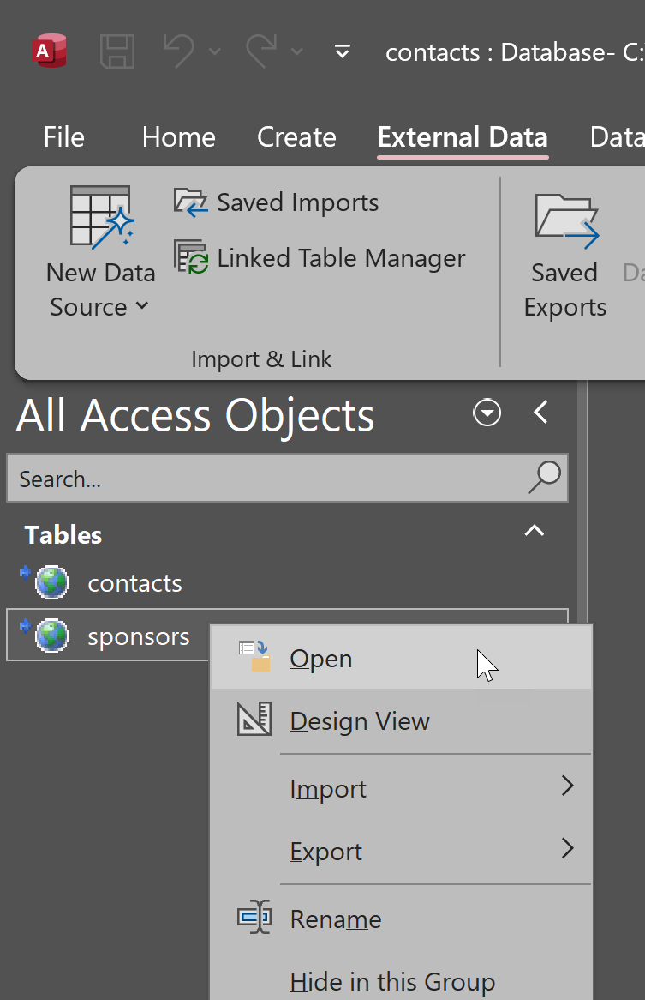
- Add some records
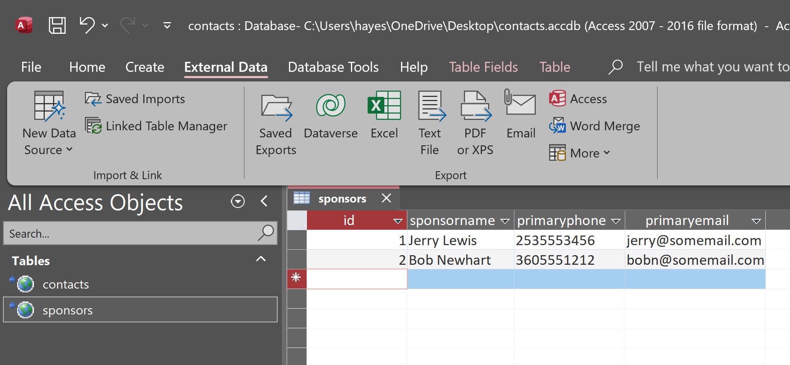
## Adding a lookup for our sponsors
- Open the design view for contacts
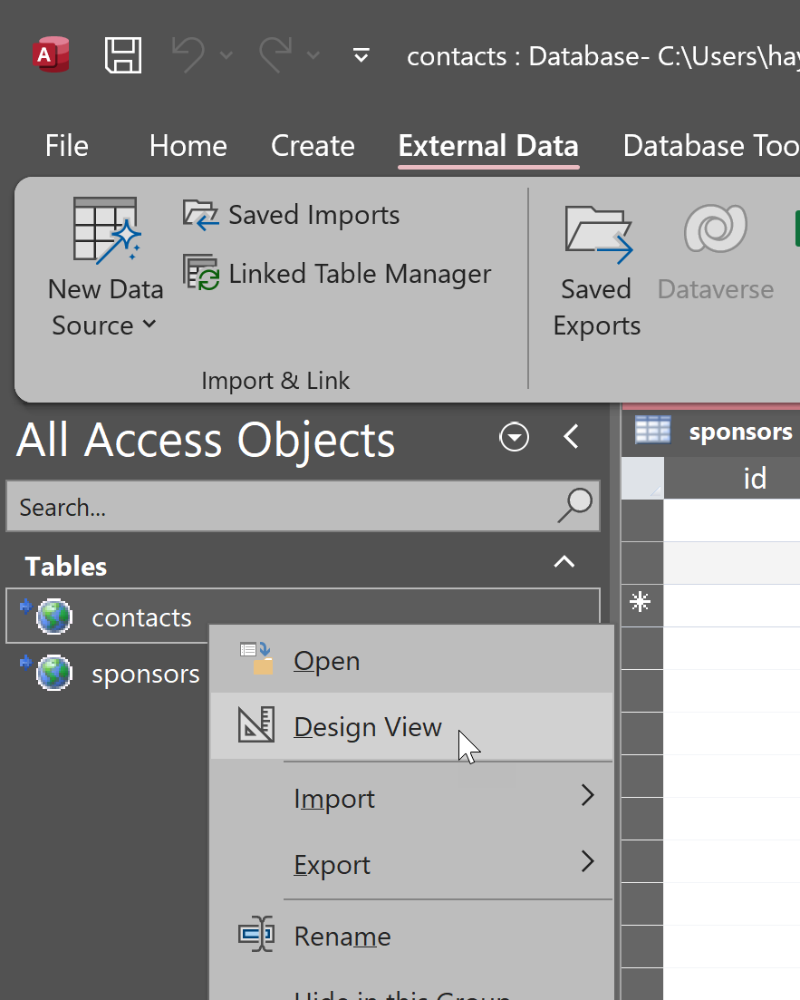
- Ignore the pop-up dialog, click OK
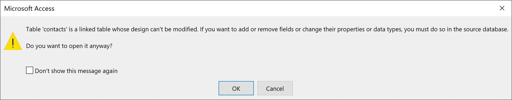
- Choose `ConboBox` as type of source
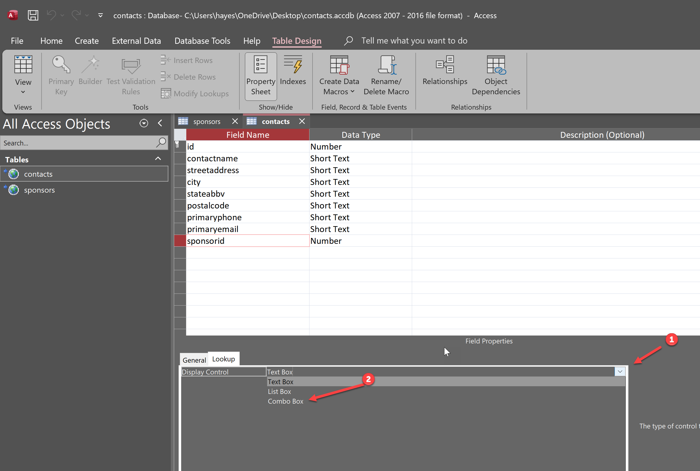
- Select the `sponsors` table as the source
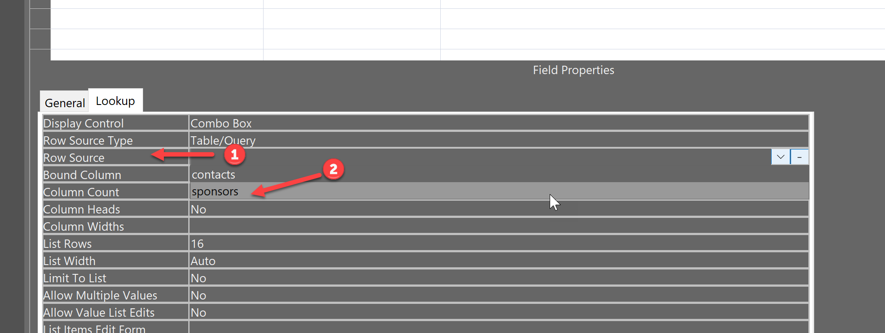
- Set your column count to 2 because you want to see the sponsor name
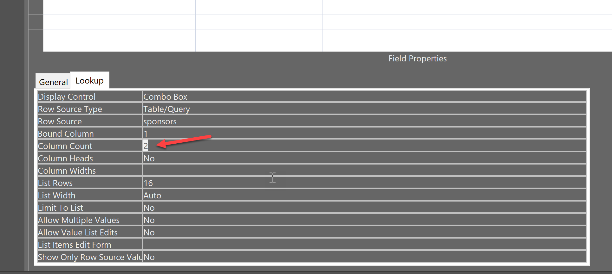
- Set your column widths to 0,20. this will hide the id column so you can see the sponsor name
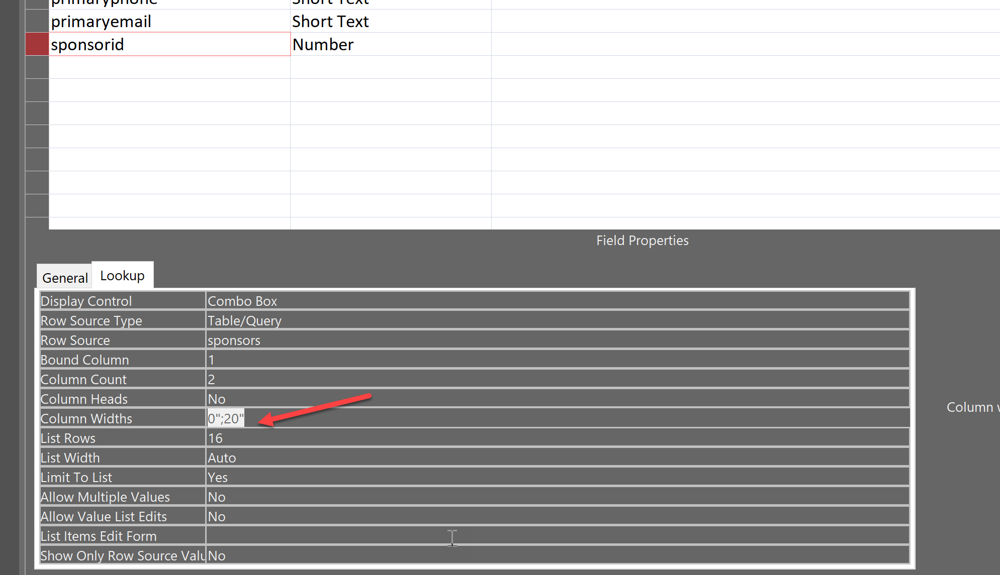
- Save the database and close the Design View
- Open the `contacts` table by double clicking it
- Now you can add sponsors to contacts
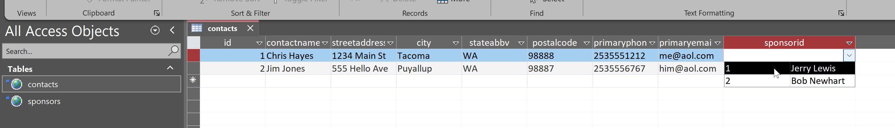
