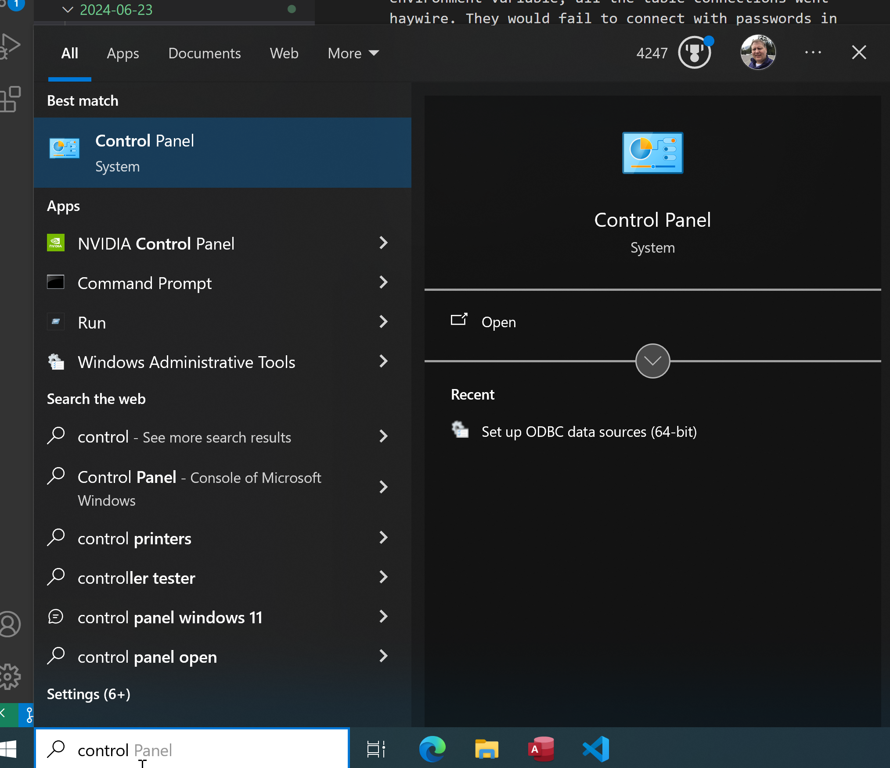

# Managing ODBC Connections
> Finding out the hard way with ODBC Connections on Windows. When we set the password in the `MYSQL_PWD` environment variable, all the table connections went haywire. They would fail to connect with passwords in the connection properties. I didn't know how to manage these connections until now. And now you will to.
## The ODBC Connection Manager
To manage ODBC Connections on a Windows PC you must use the ODBC Conneciton Managment tools in the control panel.
- Go to Control Panel on your Windows machine.
I use the search bar and type "control" and it usually pops up

- Search for ODBC Connection Mananger. I just type ODBC in the search box and it pops up

- Select the OS version of MS Access. I'm using 64 bit Access so I assumed the connection I wanted to manage was there. I was correct
- You should get this dialog. Select your connection to manange and click `Configure`

- You should get this dialog. I needed to empty my password because it was conflicting with the environment variable password kvp `MYSQL_PWD`. By emptying it I was able to reenable my tables in MS Access.
